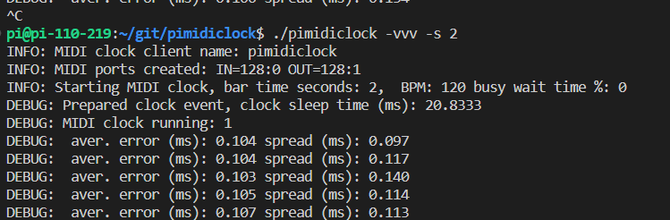

# pimidiclock
## Send MIDI clock from Linux, measure jitter and delay

Send MIDI clock with specified frequency (given as seconds per bar) and measure average delay (actual-planned) and average spread (max-min) time between sent messages. This is used to test MIDI clock jitter and delay on Linux system.

Busy wait is a way to increase precision of wait time, it may be used with a paramter.

Application creates input and output MIDI ports, optionally connects to another MIDI port to send clock signal.

On connected target device there may be huge delay and jitter even when the clock signals are sent nicely. This is often the case with MIDI over bluetooth or Wifi, this tool allows to test and debug it. 

