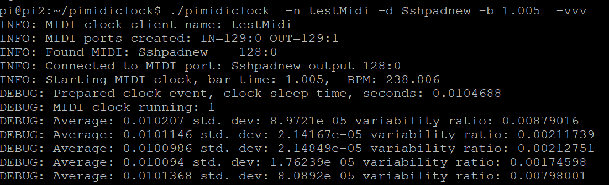

# pimidiclock
## Send MIDI clock from Linux, measure jitter and delay

Send MIDI clock with specified frequency (given as seconds per bar) and measure average and standard deviation of time between messages. Use it to test MIDI clock jitter and delay on your Linux system or as a prototype for MIDI clock generator.

This application creates input and output MIDI ports with given name, optionally connects to a MIDI port to send it clock signal.
Then it generates messages for given bar length, BPM is shown on screen. It measures actual time intervals and reports average, standard deviation and their ratio for every 96 messages or for every bar. 

